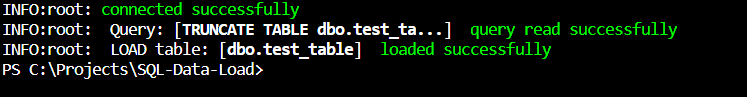

# About Project



The project is designed to work with MySQL and MSSQL databases. By integrating this project into other python projects, it is possible to select tables, load them to SQL DB and initiate sql queries using the SQL language.

Project does:
- create SSH tunnel to MySQL
- easily transitions from MySQL to MsSQL 
- Select data from SQL by tables and columns (You don't have to write the entire query, just provide the name of the table and column)
- initializes and reads the SQL queries 
- loads data into the database with the possibility of dividing into batch_size

# Project Solved problems

- Different engines are needed for MySQL and MsSQL. The project creates an engine and connection for MySQL and MsSQL using one class

# Installation

```pip install -e git+https://github.com/Polonez1/SQL-Data-Load.git#egg=pySQL```

# Import

Afrer installation, import from

```import src.pysql.pySQL as sqlconn```

\src - it's by default folder, where the installed module located
\pysql - project folder

# doc of use

```
import src.pysql.pySQL as sqlconn

sql = sqlconn.SQL(
    host="localhost",
    database="test_schema",
    user="user",
    password="pass",
    connect_type="MySQL",
)

# get data
df = sql.get_data(table="test_table", columns=["id", "name"])
or
df = sql.get_data(query = "select id, name from TestDB.dbo.test_table ")

# read sql query
sql.read_query(query="DROP TABLE dbo.test_fact")

#load data
sql.load_data_to_SQL(df=df, table='dbo.test', truncate=False, batch_size=1000)

```

## create ssh tunnel

```
ssh = SSHtunnel(
       ssh_host={ssh_host},
       ssh_username={ssh_username},
       ssh_password=ssh_password,
       remote_bind_address=("sshusername.mysql.pythonanywhere-services.com", 3306), #for example
    )
    tunnel = ssh.create_tunnel()
    tunnel.start()
    
    mysql = SQL(
       host={host},
       database={database},
       user={databaseuser},
       password={database_password},
       port=tunnel.local_bind_port,
       connect_type="MySQL",
    )
    tunnel.close()
```

# Version

- 1.1.0 Beta version
